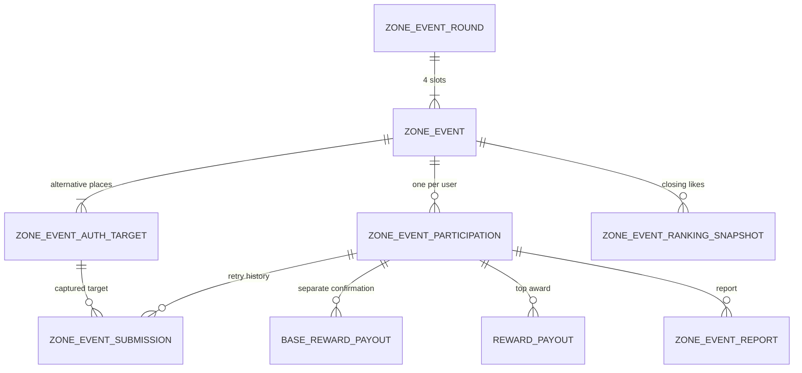

# 구역 이벤트 관리자 API 명세 · 통합 수정안

기준일: 2026-09-06. 첨부한 기존 「확정 규칙 → 스키마 매핑 / 7.1 Admin API」를 바탕으로 최신 대화와 관리자 프런트엔드를 반영했다. **아래 신규 관리자 경로와 DTO는 백엔드 합의용 계약안이며, 이미 배포된 API 목록이 아니다.** 기존 재사용 API와 신규 API를 구분한다.

## 1. 기존 문서에서 수정한 정책

| 기존 문서                                  | 이번 수정안                                                                                 |
| ------------------------------------------ | ------------------------------------------------------------------------------------------- |
| 타겟은 contentId 참조, 반경만 관리자 수정  | contentId 참조는 유지. 원본 이름·좌표를 가져오고 **타겟 위도·경도·반경을 관리자 수정 가능** |
| Top N 동점자 전원 지급                     | **동점 후보를 관리자가 확인·선택**. 자동 전원 지급 금지. 최종 선택 사유 기록                |
| 사진 승인 시 SUCCESS + BASE 즉시 지급      | SUCCESS·앨범 공개만 처리. **기본 보상도 관리자 별도 확정**                                  |
| 반려 시 FAIL, 재참여 불가                  | 새 참여는 불가하지만 **기존 참여 건에서 재제출 가능**. 다른 선택 장소 허용                  |
| 참여 row에 최종 사진 하나 저장             | 제출별 별도 이력. targetId·사진·GPS·조건·검수 결과를 매 제출마다 보존                       |
| 관리자가 close 호출해 종료                 | **서버 시간 기준 자동 시작·종료**. 정상 종료는 endsAt, close는 필요한 경우 내부 재처리 전용 |
| 마감 시각 일부 누락                        | 신규 제출·재제출·좋아요 집계 모두 `now < endsAt`까지                                        |
| Top N 지급 진행 상태에 별도 확정 단계 없음 | 후보 선정과 지급 확정을 구분. 기본 보상과 특별 보상도 각각 독립적인 지급 건                 |
| 신고의 HOLD 상태만으로 지급 단계 표현      | 지급 진행 상태와 **보류 여부 분리**, 검수 해제만으로 자동 지급 금지                         |
| 칭호 항목 중복                             | 정의·발급·사용자 장착을 한 번씩 명시                                                        |

## 2. 공통 규약

- JSON camelCase, enum SCREAMING_SNAKE, 응답 `{ "success": true, "message": "...", "data": ... }`.
- 기존 Bearer 로그인 사용. 미인증/만료 401, 인증됐으나 운영 권한 없음 403.
- 관리자 역할 범위는 `ADMIN`/`MANAGER` 재사용 제안. MANAGER에 허용할 지급·칭호 변경 범위는 백엔드 권한 정책으로 확정. 프런트 메뉴 숨김으로 서버 권한 검사를 대체하지 않음.
- 한국어 제목·설명만. 날짜 입력은 한국 시간, 요청은 offset을 포함한 ISO 8601, 저장은 UTC instant. `timezone=Asia/Seoul`.
- `eventId`는 회차 안 한 구역의 슬롯 식별자. `targetId`는 그 슬롯의 선택 장소 식별자. `placeContentId`는 기존 관광지 `contentId`. 세 ID는 서로 다름.
- `revision`은 서버가 발급·증가시키는 동시 편집 버전. 변경 요청은 `expectedRevision` 필수, 불일치는 409.
- 승인·반려·수상자 확정·지급 확정·일괄 처리·긴급 취소는 `Idempotency-Key` 헤더 사용 제안. 같은 키의 다른 payload는 409, 같은 요청 재전송은 기존 결과 반환.
- 사유, 수행 운영자, 전후 상태/설정, 시각을 서버 감사 이력으로 기록. 운영자 identity는 요청 body가 아닌 로그인 주체로 결정.
- 목록의 `page`는 1부터, `size`는 1~100 제안. `{items, page, size, totalCount}` 통일. 기존 관광지 API의 `places` 응답은 기존 계약 그대로 사용.
- 읽기용 `mediaUrl`/만료시각은 응답에 제공 가능. 저장 참조는 `fileKey`; presigned URL을 영속 데이터로 쓰지 않음.

## 3. 기존 API 재사용

| Method | 경로                                               | 활용·확인 사항                                                                                               |
| ------ | -------------------------------------------------- | ------------------------------------------------------------------------------------------------------------ |
| POST   | `/api/v1/auth/oauth/login`                         | 기존 로그인 재사용                                                                                           |
| GET    | `/api/v1/users/me`                                 | 기존 사용자 정보. 역할 정보 제공 범위는 `/admin/me`와 계약 맞춤                                              |
| GET    | `/api/v1/places/search?keyword=&page=1&size=5`     | 기존 관광지 검색. `contentId`, `contentTypeId`, `title`, `latitude`, `longitude`를 선택 장소 기본값으로 사용 |
| GET    | `/api/v1/places/{contentId}/detail?contentTypeId=` | 상세 필요 시 재사용. 기존 프런트 래퍼는 `contentTypeId`를 전달함                                             |
| POST   | `/api/v1/files`                                    | 예시 이미지 업로드. multipart 요청, 응답 fileKey 활용                                                        |

기존 문서의 `GET /api/v1/files?fileKey=`는 이번 검토에서 실제 제공 여부를 확인하지 못했다. 있다고 가정하지 말고 파일팀과 확인한다. 검수 상세 응답에서 접근 가능한 이미지 URL을 내려주는 계약도 가능하다.

관광지 검색은 관리자 데이터를 저장하는 API가 아니다. **관광지 마스터 수정 API는 필요하지 않다.** 수정한 좌표는 아래 타겟 API에만 저장한다.

### 장소 선택 및 좌표 수정

1. 기존 검색 결과에서 관광지 선택.
2. `contentId`를 `placeContentId`로 연결. API 이름과 원본 좌표를 화면에 표시.
3. 운영자가 인증 중심의 `latitude`, `longitude`, `radiusM`을 수정.
4. 타겟 등록 시 원본 좌표와 최종 인증 좌표를 별도 보존.
5. 타겟 저장·수정·교체 시에도 관광지 마스터는 변경하지 않음.

`contentId`가 외부 관광 API 식별자이고 로컬 DB 장소 테이블이 없다면 논리 참조로 검증한다. 실제 SQL FK 여부는 기존 장소 저장 구조에 맞춰 정한다.

## 4. 스키마 보완

| 엔티티                                                          | 필수 보완                                                                                                                                                                                              |
| --------------------------------------------------------------- | ------------------------------------------------------------------------------------------------------------------------------------------------------------------------------------------------------ |
| zone_event_round                                                | roundNo, name, startsAt, endsAt, timezone, status, revision, closedAt. roundNo 고유                                                                                                                    |
| zone_event                                                      | roundId, zoneId, slotCode, title, description, typeCode, baseReward, topN/excellenceReward 또는 회차 기본값. UK `(roundId,zoneId)`, `(roundId,slotCode)`                                               |
| zone_event_auth_target                                          | placeContentId 필수, contentTypeId 필요 시 보관, placeName, sourceLatitude/sourceLongitude, 관리자 최종 latitude/longitude, radiusM, guideText, exampleFileKey, status, revision                       |
| zone_event_participation                                        | UK `(userId,eventId)`, currentSubmissionId, 상태, joinedAt, completedAt, 최초 기본 보상 스냅샷                                                                                                         |
| **zone_event_submission (추가)**                                | participationId, attemptNo, targetId, placeContentId/이름/조건/좌표/반경 스냅샷, mediaFileKey, gpsLat/gpsLng, capturedAt, submittedAt, reviewStatus, rejectionReason, reviewedBy, reviewedAt, revision |
| reward_grant                                                    | 실제 포인트·배지 반영 원장. 사진 승인 시 생성 금지. 지급 확정 흐름에서 원자적으로 반영                                                                                                                 |
| **base_reward_payout (추가 또는 통합 지급 테이블의 BASE 유형)** | participationId, 보상 스냅샷, status, holdStatus, scheduledAt, confirmedBy/At, paidAt, failureCode, revision                                                                                           |
| reward_payout                                                   | TOP_LIKE 지급 건. eventId, participationId, rankN, likeCountAtClose, reward 내용 스냅샷, 지급 상태, 보류 상태, 일정, 확정·메일·수집·발송 시각, revision                                                |
| **zone_event_ranking_snapshot (추가)**                          | eventId, closedAt, snapshotId/version, 참여별 마감 좋아요·순위·동점, 집계 완료 상태                                                                                                                    |
| zone_event_report                                               | participationId, reporterId, reason, status, reviewedBy/At, decisionNote, 후속 조치                                                                                                                    |
| zone_title_def / user_zone_title                                | 구역 단계 정의와 발급 분리, 정의 revision. 대표 칭호는 사용자 1개 선택                                                                                                                                 |
| **admin_event_audit (추가)**                                    | actorId, action, resourceType/id, before/after 또는 diff, reason, createdAt, requestId                                                                                                                 |

참여의 기존 `mediaFileKey`, `targetId`, GPS 필드를 유지한다면 최신 제출 조회용 projection으로만 사용한다. 원본 이력은 submission이 기준이다. 타겟 교체로 기존 제출의 target FK와 스냅샷을 덮어쓰지 않는다.



## 5. 세션·회차·슬롯 API

| Method      | Path                                                 | 계약                                                                |
| ----------- | ---------------------------------------------------- | ------------------------------------------------------------------- |
| GET         | `/api/v1/admin/me`                                   | `{userId,nickname,role,permissions}`. 이메일은 필요한 화면에만 제공 |
| GET         | `/api/v1/admin/zone-event-rounds`                    | status/from/to/keyword/page/size                                    |
| GET         | `/api/v1/admin/zone-event-rounds/{roundId}`          | 회차 설정, slots, 집계·검수·정산 진행 상태, revision                |
| POST        | `/api/v1/admin/zone-event-rounds`                    | 회차 초안 생성                                                      |
| PATCH       | `/api/v1/admin/zone-event-rounds/{roundId}`          | 초안·예정 설정 변경. expectedRevision                               |
| POST        | `/api/v1/admin/zone-event-rounds/{roundId}/schedule` | 4슬롯·타겟·시간 검증 후 SCHEDULED 확정                              |
| POST        | `/api/v1/admin/zone-event-rounds/{roundId}/cancel`   | 긴급 회차 취소. reason, expectedRevision. 기존 이력 보존            |
| GET / POST  | `/api/v1/admin/zone-events`                          | 슬롯 목록/생성. 목록 roundId/zoneId/status/page/size                |
| GET / PATCH | `/api/v1/admin/zone-events/{eventId}`                | 슬롯 상세/편집. 변경 사유·expectedRevision                          |
| POST        | `/api/v1/admin/zone-events/{eventId}/cancel`         | 구역 슬롯 긴급 취소. 기존 검수·보상 이력 유지                       |

회차 생성 예:

```json
{
  "roundNo": 1,
  "name": "부산 바다 인증의 날",
  "startsAt": "2026-09-10T10:00:00+09:00",
  "endsAt": "2026-09-11T10:00:00+09:00",
  "timezone": "Asia/Seoul",
  "topN": 5,
  "excellenceReward": { "rewardType": "CUSTOM", "name": "운영자 선정 로컬 선물" }
}
```

- `topN`과 특별 보상은 회차 기본값으로 제공 가능하지만 **순위·선정 단위는 eventId(구역 슬롯)**. 슬롯별 override 허용 여부는 한 방식으로 합의한다.
- 회차 번호는 서버 발급 방식 권장. 직접 입력을 유지하면 중복을 409로 검증. slotCode는 서버가 `{roundNo}-A`~`D` 생성 또는 검증.
- 초안은 4개 미만 슬롯 가능. **예약 확정 시 정확히 4개 서로 다른 구역**, 각 슬롯에 ACTIVE 타겟 1개 이상 필요.
- 같은 시간대 같은 구역의 ACTIVE/SCHEDULED 슬롯 중복 방지. startsAt 포함, endsAt 제외.
- 정상 상태 전환: DRAFT → SCHEDULED → ACTIVE → CLOSED. ACTIVE/CLOSED를 일반 PATCH로 임의 지정하지 않음.
- 자동 시작·종료는 서버 시계/스케줄러. 사용자 요청에서도 시간을 직접 검사하여 Job 지연으로 마감 이후 접수되지 않게 함.
- 이전 `/close`는 운영자 수동 정상 종료 버튼에서 제외. 내부 재처리 기능이 필요하면 endsAt 이후만, 멱등·권한 제한·감사 기록 적용.
- 프런트 샘플의 미션 목록은 편집 편의를 위한 모델이다. 실제 연결 시 미션은 슬롯 이벤트에 귀속한다. 여러 회차가 동일 eventId/타겟 설정을 공유해 과거 내용이 함께 수정되지 않게 한다. 템플릿을 추가한다면 회차 등록 시 별도 슬롯 스냅샷 생성.

## 6. 인증 타겟 API — 수정 좌표 포함

| Method     | Path                                                             | 계약                                                                               |
| ---------- | ---------------------------------------------------------------- | ---------------------------------------------------------------------------------- |
| GET / POST | `/api/v1/admin/zone-events/{eventId}/targets`                    | 타겟 목록/추가                                                                     |
| PATCH      | `/api/v1/admin/zone-events/{eventId}/targets/{targetId}`         | latitude/longitude/radiusM/guideText/exampleFileKey 수정, expectedRevision, reason |
| POST       | `/api/v1/admin/zone-events/{eventId}/targets/{targetId}/replace` | 다른 contentId로 긴급 교체. 기존 REPLACED, 새 targetId ACTIVE                      |
| POST       | `/api/v1/admin/zone-events/{eventId}/targets/{targetId}/cancel`  | 타겟 CANCELLED. 기존 제출 보존                                                     |

등록 body — **기존 문서의 ‘radiusM만 관리자 값’을 수정**:

```json
{
  "targetKind": "PLACE",
  "placeContentId": "126081",
  "contentTypeId": "12",
  "latitude": 35.1532,
  "longitude": 129.1181,
  "radiusM": 80,
  "guideText": "풍경과 손이 함께 보이게 촬영",
  "exampleFileKey": "uploads/images/example.jpg"
}
```

위 contentId·좌표는 요청 형태 예시이며 실제 장소 매칭값을 보장하지 않는다.

- 서버가 contentId 존재를 확인하고 이름과 **원본 좌표**를 기존 장소 데이터에서 스냅샷한다. 요청 latitude/longitude는 **실제 인증 중심 좌표**로 저장한다.
- 생성 시 latitude/longitude를 둘 다 생략하면 원본 좌표 사용. 하나만 전달하면 400. 수정 시 부분 좌표 허용 여부를 혼동하지 않도록 **쌍으로 전송**한다.
- 위도 -90~90, 경도 -180~180, 유한 수, radiusM 양의 정수. 최대 반경은 운영 정책으로 제한. 기존 장소 마스터에 PATCH하지 않는다.
- 응답: `{targetId,eventId,placeContentId,contentTypeId,placeName,sourceLatitude,sourceLongitude,latitude,longitude,radiusM,guideText,exampleFileKey,coordinatesOverridden,status,revision}`.
- 같은 슬롯 내 같은 contentId 중복은 409 제안. 같은 contentId의 별도 포토존이 필요한 경우 target 구분 정책을 따로 확정한다.
- 좌표·조건 변경도 revision을 올리고 이전 설정 이력을 남긴다. 기존 참여는 제출 당시 좌표·반경으로 검수한다.
- 선택 장소 하나만 취소해 ACTIVE 타겟이 0개가 되면 신규 참여 중지. 슬롯 자체 취소 여부는 명시적 작업으로 처리한다.

## 7. 사용자 참여·재제출 계약 보완

관리자 API만 추가해서 전체 흐름이 완성되는 것은 아니다. 기존 사용자 참여·제출도 아래 정책으로 확장해야 한다.

| Method | Path                                                                    | 계약                                                                         |
| ------ | ----------------------------------------------------------------------- | ---------------------------------------------------------------------------- |
| GET    | `/api/v1/zone-events/{eventId}`                                         | targets 배열, slotCode, 현재 참여/검수 상태, canResubmit, deadline           |
| POST   | `/api/v1/zone-events/{eventId}/participations`                          | targetId + GPS. 동일 user/event 재생성은 409, 기존 participationId 반환 가능 |
| POST   | `/api/v1/zone-events/{eventId}/participations/{participationId}/submit` | 아래 body. 첫 제출 또는 반려 후 재제출. 항상 새 submissionId 생성            |
| GET    | `/api/v1/users/me/zone-event-participations`                            | 최근 상태와 제출 이력·반려 사유·재제출 가능 여부                             |

```json
{
  "targetId": "다른-선택-장소의-uuid",
  "mediaFileKey": "uploads/images/camera.jpg",
  "latitude": 35.1532,
  "longitude": 129.1181,
  "capturedAt": "2026-09-10T14:00:00+09:00",
  "content": "선택 후기"
}
```

- targetId는 반드시 같은 eventId의 현재 ACTIVE 타겟. 다른 구역 targetId는 거부.
- GPS 검증은 서버에서 **수정된 타겟 좌표** 기준. 제출 시각은 서버 수신 시각 사용.
- 같은 참여 건의 재제출은 직전 submission이 REJECTED일 때만. UNDER_REVIEW/SUCCESS에서 다시 제출 불가.
- 제출된 사진 row 자체 수정 금지. 반려 후 새 이력 추가로 참여 1회 제약과 재제출을 양립.
- `now >= endsAt`이면 신규/재제출 모두 거부. 마감 후 검수에서 반려해도 재제출 연장하지 않음.
- 앱 카메라 전용 UX 유지. **fileKey나 클라이언트 source=CAMERA 선언만으로 갤러리 촬영 여부를 증명할 수는 없다.** 서버는 파일 소유권·업로드 세션·이미지 타입을 검증하고, 촬영 세션 연계가 필요하면 파일/모바일팀과 계약한다. 기존 feature 코드에는 업로더 검증이 보류돼 있으므로 함께 보완.

## 8. 전체 참여·사진 검수

| Method | Path                                                         | 계약                                                                    |
| ------ | ------------------------------------------------------------ | ----------------------------------------------------------------------- |
| GET    | `/api/v1/admin/zone-event-participations`                    | 전체 참여 목록. roundId/eventId/zoneId/userId/status/keyword/page/size  |
| GET    | `/api/v1/admin/zone-event-reviews`                           | 검수 큐. 기본 UNDER_REVIEW, roundId/eventId/zoneId/page/size            |
| GET    | `/api/v1/admin/zone-event-reviews/{participationId}`         | 사용자 표시 정보, 현재 제출, 전체 제출 이력, 당시 타겟/보상 스냅샷      |
| POST   | `/api/v1/admin/zone-event-reviews/{participationId}/approve` | `{submissionId,expectedRevision}`. SUCCESS·공개, **보상 지급 없음**     |
| POST   | `/api/v1/admin/zone-event-reviews/{participationId}/reject`  | `{submissionId,reason,expectedRevision}`. 해당 제출 REJECTED, 이력 보존 |

검수 상세 응답 추가 예:

```json
{
  "participationId": "uuid",
  "eventId": "uuid",
  "slotCode": "1-B",
  "status": "UNDER_REVIEW",
  "revision": 3,
  "canResubmit": false,
  "submissionDeadline": "2026-09-11T10:00:00+09:00",
  "submissions": [
    {
      "submissionId": "uuid",
      "attemptNo": 2,
      "targetId": "uuid",
      "placeContentId": "126081",
      "placeName": "관광지 이름",
      "targetLatitude": 35.1532,
      "targetLongitude": 129.1181,
      "radiusM": 80,
      "guideTextSnapshot": "촬영 조건",
      "gpsLat": 35.1532,
      "gpsLng": 129.1181,
      "distanceM": 0,
      "gpsInsideRadius": true,
      "mediaFileKey": "uploads/images/photo.jpg",
      "mediaUrl": "https://...",
      "submittedAt": "...",
      "reviewStatus": "UNDER_REVIEW",
      "rejectionReason": null,
      "reviewedAt": null,
      "reviewedBy": null
    }
  ]
}
```

같은 submission을 동시 승인/반려하면 한 요청만 성공. 새 재제출 후 이전 submissionId를 승인하려는 요청은 409. 운영자·시각은 서버에서 채운다. 승인 후 칭호 발급은 누적 집계에 따르되 대표 칭호 자동 장착은 하지 않는다.

## 9. 좋아요 마감·수상자

- 기존 앨범·좋아요·댓글·신고 사용자 API는 유지. 앨범은 SUCCESS만 공개.
- 좋아요 생성·취소는 회차 종료 전에만. 순위는 종료 시각 스냅샷 기준으로 고정.
- 마감 후 승인된 사진은 공개될 수 있지만 마감 이전 좋아요를 소급 생성하지 않는다.

| Method | Path                                                   | 계약                                                                               |
| ------ | ------------------------------------------------------ | ---------------------------------------------------------------------------------- |
| GET    | `/api/v1/admin/zone-event-rounds/{roundId}/top-n`      | eventId 필터, 구역별 frozen snapshot 및 모든 경계 동점 후보. 자동 전원 수상 아님   |
| POST   | `/api/v1/admin/zone-events/{eventId}/winners/confirm`  | `{snapshotId,participationIds,selectionReason,expectedRevision}`. 운영자 최종 선정 |
| POST   | `/api/v1/admin/zone-events/{eventId}/payouts/generate` | **확정된 수상자만** TOP_LIKE 지급 후보 생성, 멱등                                  |

```json
{
  "roundId": "uuid",
  "closedAt": "...",
  "events": [
    {
      "eventId": "uuid",
      "slotCode": "1-B",
      "topN": 5,
      "snapshotId": "uuid",
      "revision": 1,
      "cutoffLikeCount": 24,
      "entries": [
        {
          "participationId": "uuid",
          "rankN": 5,
          "likeCountAtClose": 24,
          "tied": true,
          "eligible": true,
          "heldByReport": false,
          "selected": false
        }
      ]
    }
  ]
}
```

프런트 샘플은 최대 N명 제한, 경계 동점 중 운영자 선택을 구현했다. 정원 초과 특별 선정이 필요하면 별도 정책 변경이다. 선정 당시 미해결 신고는 우선 보류하고, 보류 해제 후 다른 수상자에 미치는 영향·확정 잠금은 서버 정산 규칙으로 일관되게 처리한다.

## 10. 신고 검수

| Method | Path                                                   | 계약                                                                          |
| ------ | ------------------------------------------------------ | ----------------------------------------------------------------------------- |
| GET    | `/api/v1/admin/zone-event-reports`                     | status/roundId/eventId/participationId/page/size                              |
| GET    | `/api/v1/admin/zone-event-reports/{reportId}`          | 신고 내용·검수 대상·관련 지급 건                                              |
| POST   | `/api/v1/admin/zone-event-reports/{reportId}/uphold`   | note/action/expectedRevision. 신고 인정, 지급 보류 유지 또는 정책에 따른 실격 |
| POST   | `/api/v1/admin/zone-event-reports/{reportId}/dismiss`  | note/expectedRevision. 신고 기각. 다른 미해결 신고가 있으면 지급 보류 유지    |
| POST   | `/api/v1/admin/reward-payouts/{payoutId}/release-hold` | 최종 검수 근거 + expectedRevision. 미해결 신고 확인 후 해제, 자동 지급 없음   |

신고 접수 시 미지급 관련 보상은 지급 보류하도록 정책 적용. `OPEN/REVIEWING/UPHELD/DISMISSED`와 지급의 holdStatus는 구분한다. 신고가 여러 개면 마지막 한 건 기각만으로 무조건 지급 가능 처리하지 않는다.

신고 인정 시 칭호 회수·실격·기지급 보상 회수의 허용 범위는 추가 정책 확정 대상이다. 임의 상태 PATCH나 참여 삭제로 처리하지 않는다.

## 11. 기본·특별 보상, 일정, 안내·발송 기록

기본 포인트·배지와 TOP_LIKE 보상은 독립 지급 건이다. 테이블은 분리하거나 `rewardReason=BASE|TOP_LIKE`로 통합하되 한 건의 상태를 공유하지 않는다.

| Method | Path                                               | 계약                                                                               |
| ------ | -------------------------------------------------- | ---------------------------------------------------------------------------------- |
| GET    | `/api/v1/admin/reward-payouts`                     | roundId/eventId/rewardReason/status/holdStatus/scheduledFrom/scheduledTo/page/size |
| GET    | `/api/v1/admin/reward-payouts/{payoutId}`          | 스냅샷·일정·단계별 처리 이력                                                       |
| PATCH  | `/api/v1/admin/reward-payouts/{payoutId}`          | 품목 미정 건의 보상 설정·메모·일정. 확정 후 임의 보상 변경 불가                    |
| POST   | `/api/v1/admin/reward-payouts/bulk-confirm`        | payoutIds, 각 expectedRevision. 사진 승인/수상자/보류/지급 일정 검증 후 별도 확정  |
| POST   | `/api/v1/admin/reward-payouts/bulk-schedule`       | payoutIds, scheduledAt, expectedRevisions. 신고 대상 별도 지급일 지정              |
| POST   | `/api/v1/admin/reward-payouts/mark-mail-sent`      | TOP_LIKE 안내 메일 **수동 발송 기록**, mailedAt, note                              |
| POST   | `/api/v1/admin/reward-payouts/mark-info-collected` | **기존 명세에서 추가**. informationCollectedAt, note                               |
| POST   | `/api/v1/admin/reward-payouts/mark-sent`           | TOP_LIKE 실제 발송 완료 기록, sentAt, reference/note                               |
| POST   | `/api/v1/admin/reward-payouts/{payoutId}/retry`    | 지급 실패 재시도. 동일 지급 키로 중복 방지                                         |

상태 제안:

- BASE: PENDING_CONFIRM → CONFIRMED → PAID, 실패 시 FAILED. 서버가 포인트·배지 원장과 함께 실제 반영. 단순 UI 기록만으로 PAID로 바꾸지 않음.
- TOP_LIKE: PENDING_ASSIGN → PENDING_CONFIRM → CONFIRMED → MAIL_SENT → INFO_COLLECTED → SENT. 품목 미정 단계가 필요 없으면 PENDING_ASSIGN 생략.
- 보류: 별도 `holdStatus=NONE|HELD_REPORT`. 지급 단계는 보존한다. 해제 시 이전 단계로 돌아가고 최종 일정·확정 조건을 다시 검사.
- `scheduledAt`은 모든 단계에서 관리 가능한 지급 예정일이다. 별도 SCHEDULED enum 하나로 메일/정보수집 진행 상태를 덮어쓰지 않는다.
- `confirmedAt/By`, `mailedAt`, `informationCollectedAt`, `sentAt`, `failureCode`, `revision`, 고정 보상 스냅샷을 응답에 포함.
- 샘플 UI는 예정일 도달 후 확정/처리를 허용한다. 안내 메일을 지급일 이전에 보낼지 등 사전 준비 시점은 서버 연결 전에 합의한다.
- 일괄 처리 원자성은 all-or-nothing 제안. 한 건이라도 신고 보류·상태 충돌이면 처리 없이 409와 문제 payoutIds 반환. 부분 성공을 허용한다면 항목별 성공/실패 계약으로 명확히 구분.
- **메일 발송 API 자체가 초기 필수는 아니다.** 운영자가 외부에서 메일·실물 발송하고 상태를 기록하는 방식 지원. 개인정보 수집 항목·메일 템플릿은 별도 확정.

## 12. 칭호·통계·감사 이력

| Method     | Path                                             | 계약                                                                    |
| ---------- | ------------------------------------------------ | ----------------------------------------------------------------------- |
| GET / POST | `/api/v1/admin/zone-titles`                      | 구역별 정의 조회/추가                                                   |
| PATCH      | `/api/v1/admin/zone-titles/{titleDefId}`         | titleName/requiredSuccessCount/expectedRevision. 소급 여부 명시         |
| DELETE     | `/api/v1/admin/zone-titles/{titleDefId}`         | 미발급 정의만, 보유자 있으면 409                                        |
| GET        | `/api/v1/admin/zone-titles/{titleDefId}/holders` | **추가**. 발급 현황·보유자 조회, page/size                              |
| GET        | `/api/v1/admin/zone-event-stats`                 | roundId 또는 from/to, 슬롯별 참여·승인·대기·신고·보상·신규 칭호 발급 수 |
| GET        | `/api/v1/admin/zone-event-audits`                | **추가**. resourceType/id, actorId, from/to, page/size                  |

칭호 조건은 구역별 양의 정수 증가, UK `(zoneId,tier)`/`(zoneId,requiredSuccessCount)`. 1/3/7은 예시. 승인 성공 누적 기준, 기본/특별 보상 지급과 독립. 사용자 `GET /users/me/zone-titles`, `PATCH /users/me/zone-titles/{id}/equip` 유지.

통계에는 `joinedCount`, `submittedCount`(참여 건 기준), `submissionAttemptCount`(재제출 포함), `successCount`, `failCount`, `pendingReviewCount`, `openReportCount`, `basePaidCount`, `specialSentCount`, `topContent`, `newTitleGrantCount` 제공 제안. successRate 분모를 참여 건으로 명시한다.

## 13. 구현·연동 상태와 우선순위

| 항목                              | 현재 프런트                                             | 백엔드 요청                                      |
| --------------------------------- | ------------------------------------------------------- | ------------------------------------------------ |
| 관광지 검색                       | 기존 API + TanStack Query 연결, 검색·페이지·오류·재시도 | 기존 검색 서비스 정상 응답 확인                  |
| 타겟 좌표 수정                    | contentId 고정, 원본/수정 좌표 분리, 원본 복원          | target POST/PATCH/replace 좌표 입력 계약         |
| 회차·미션·검수·보상·칭호·통계     | 샘플 상태로 운영 흐름 구현                              | 위 관리자 API에 교체 연결                        |
| 인증/권한·스케줄·동시성·실제 지급 | 프런트만으로 구현할 수 없음                             | 서버 구현 필수                                   |
| 쿠폰 재고·월 예산                 | 현재 미구현, 원 운영안에 존재                           | 운영 범위 포함 여부와 재고/예산 스키마 별도 합의 |

우선순위: 관리자 권한 → 회차/슬롯/타겟 → 제출 이력/검수/재제출 → 기본 보상 별도 확정 → 마감 순위/수상자/특별 지급 → 신고/칭호/리포트.

2026-09-06 실서버 `/api/v1/places/search` 직접 조회에서 해운대 검색의 HTTP 200 응답과 contentId·좌표를 확인했다. 다른 요청에서는 내부 오류도 관찰됐다. localhost:3001 브라우저에서는 `Failed to fetch`로 검색이 실패하여 CORS·접속 환경 확인이 필요하다. 프런트는 오류와 재시도를 표시하며 가짜 결과로 대체하지 않는다. 관리자 미션 저장은 여전히 샘플 메모리에만 반영된다.
